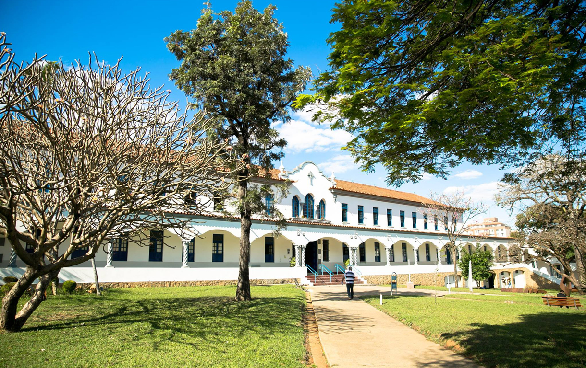

# Nome do Evento
`Data do Evento`

## Palestrante
> Inclua a lista dos palestrantes do evento.
> - Ciclano Albuquerque

## Descrição do Evento
> Colocar uma breve descrição do evento

> Colocar o folder do evento

[Fotos do Evento](https://)

> Colocar link para as fotos no drive dos eventos do curso

[Material do Evento](docs/file.txt)

> Quando o apresentador disponibilizar o material utilizado, vincular neste local
